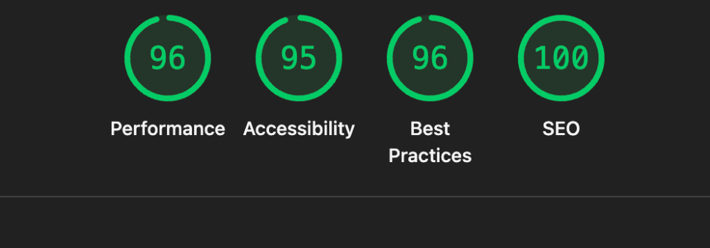

# React + TypeScript + Vite

[Live Demo](https://rick-and-morty-test-three.vercel.app/)

AppSpace Rick and Morty Theme test


## Performance & Quality

The application has been audited using Google Chrome DevTools Lighthouse to ensure high performance, accessibility, and SEO standards.

### Lighthouse Results



| Category | Score |
| :--- | :--- |
| **Performance** | 96 |
| **Accessibility** | 95 |
| **Best Practices** | 96 |
| **SEO** | 100 |

## Test Coverage

The project maintains high test coverage across components, hooks, and services.

| File | % Stmts | % Branch | % Funcs | % Lines |
| :--- | :--- | :--- | :--- | :--- |
| **All files** | 95.69 | 84.93 | 96.05 | 95.71 |

Run the coverage report locally:
```bash
yarn test --coverage
```
